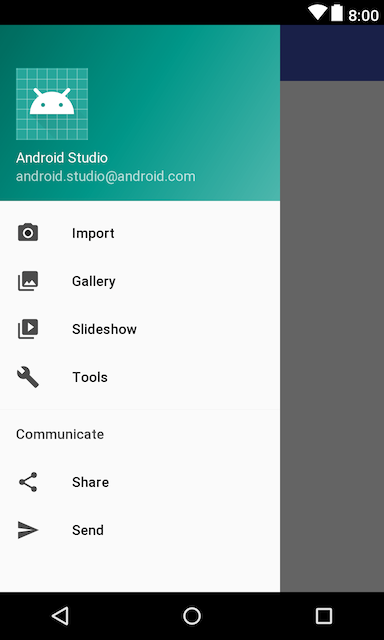
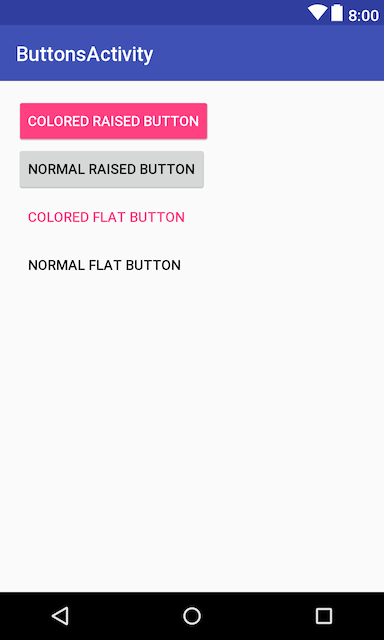

# マテリアルデザインのUIサンプル集

## Android Design Support Library の導入

- `app/build.gradle`に以下を追加する

```java
dependencies {
  implementation 'com.android.support:design:26.1.0'
}
```

## DrawerLayout & NavigationView

- レイアウト構成は以下の通り

```xml
<android.support.v4.widget.DrawerLayout>

    <android.support.design.widget.CoordinatorLayout>

        <android.support.design.widget.AppBarLayout>
            <android.support.v7.widget.Toolbar />
        </android.support.design.widget.AppBarLayout>

        <RelativeLayout />

    </android.support.design.widget.CoordinatorLayout>

    <android.support.design.widget.NavigationView />

</android.support.v4.widget.DrawerLayout>
```

- 左上のメニューボタンに関する実装

```java
  Toolbar toolbar = findViewById(R.id.toolbar);
  setSupportActionBar(toolbar);

  DrawerLayout drawer = findViewById(R.id.drawer_layout);
  ActionBarDrawerToggle toggle = new ActionBarDrawerToggle(
          this, drawer, toolbar, R.string.navigation_drawer_open, 
          R.string.navigation_drawer_close);
  drawer.addDrawerListener(toggle);
  toggle.syncState();
```

- `NavigationView`にはメニューリソースを設定することで項目が登録できる
- またヘッダーレイアウトも設定可能

```xml
    <android.support.design.widget.NavigationView
        android:id="@+id/nav_view"
        android:layout_width="wrap_content"
        android:layout_height="match_parent"
        android:layout_gravity="start"
        android:fitsSystemWindows="true"
        app:headerLayout="@layout/nav_header_drawer_layout"
        app:menu="@menu/activity_drawer_layout_drawer" />
```

```xml
<menu>
    <group android:checkableBehavior="single">
        <item
            android:id="@+id/nav_camera"
            android:icon="@drawable/ic_menu_camera"
            android:title="Import" />
        <item
            android:id="@+id/nav_gallery"
            android:icon="@drawable/ic_menu_gallery"
            android:title="Gallery" />
        <item
            android:id="@+id/nav_slideshow"
            android:icon="@drawable/ic_menu_slideshow"
            android:title="Slideshow" />
        <item
            android:id="@+id/nav_manage"
            android:icon="@drawable/ic_menu_manage"
            android:title="Tools" />
    </group>

    <item android:title="Communicate">
        <menu>
            <item
                android:id="@+id/nav_share"
                android:icon="@drawable/ic_menu_share"
                android:title="Share" />
            <item
                android:id="@+id/nav_send"
                android:icon="@drawable/ic_menu_send"
                android:title="Send" />
        </menu>
    </item>
</menu>
```



- あとは、`NavigationView`にリスナーを設定

```java
  NavigationView navigationView = findViewById(R.id.nav_view);
  navigationView.setNavigationItemSelectedListener(new NavigationView.OnNavigationItemSelectedListener() {
      @Override
      public boolean onNavigationItemSelected(@NonNull MenuItem item) {
        int id = item.getItemId();

        switch (id) {
          /* implemnts each functions */
        }

        DrawerLayout drawer = findViewById(R.id.drawer_layout);
        drawer.closeDrawer(GravityCompat.START);
        return true;
      }
  });
```

## Buttons

- マテリアルデザイン用のボタンはスタイルを設定するだけでOK

```xml
<Button
    style="@style/Widget.AppCompat.Button.Colored"
    android:text="Colored Raised Button" />

<Button
    style="@style/Widget.AppCompat.Button"
    android:text="Normal Raised Button" />

<Button
    style="@style/Widget.AppCompat.Button.Borderless.Colored"
    android:text="Colored Flat Button" />

<Button
    style="@style/Widget.AppCompat.Button.Borderless"
    android:text="Normal Flat Button" />
```



## Animation Icon

- [Creative custmization - Icons][1]
- [Drawable Animation][2]

- リソースの作り方
  - [ic_menu_24dp.xml](../app/src/main/res/drawable/ic_menu_24dp.xml)
  - [ic_arrow_24dp.xml](../app/src/main/res/drawable/ic_arrow_24dp.xml)

- 実装

```java
    private boolean menuFlag = true;
    private AnimatedVectorDrawable menuDrawable;
    private AnimatedVectorDrawable arrowDrawable;

    @Override
    protected void onCreate(Bundle savedInstanceState) {
        super.onCreate(savedInstanceState);
        setContentView(R.layout.activity_animation_icon);

        menuDrawable = (AnimatedVectorDrawable) getDrawable(R.drawable.ic_menu_24dp);
        arrowDrawable = (AnimatedVectorDrawable) getDrawable(R.drawable.ic_arrow_24dp);

        final Toolbar toolbar = findViewById(R.id.toolbar);
        toolbar.setNavigationIcon(menuDrawable);
        toolbar.setNavigationOnClickListener(new View.OnClickListener() {
            @Override
            public void onClick(View v) {
                if (menuFlag) {
                    toolbar.setNavigationIcon(menuDrawable);
                    menuDrawable.start();
                } else {
                    toolbar.setNavigationIcon(arrowDrawable);
                    arrowDrawable.start();
                }
                menuFlag = !menuFlag;
            }
        });
    }
```

[1]:https://material.io/guidelines/motion/creative-customization.html#creative-customization-icons
[2]:https://developer.android.com/guide/topics/graphics/drawable-animation.html

## Effect

- `Ripple effect`

```xml
  <TextView
      android:id="@+id/non_effect"
      android:text="Non effect text view"
      android:padding="16dp"
      android:layout_width="wrap_content"
      android:layout_height="wrap_content" />

  <TextView
      android:id="@+id/ripple_effect"
      android:text="Ripple effect text view"
      android:padding="16dp"
      android:background="?attr/selectableItemBackground"
      android:layout_width="wrap_content"
      android:layout_height="wrap_content" />
```

- `Reveal effect`

```xml
<FrameLayout>
    <View android:id="@+id/base" />
    <View android:id="@+id/reveal" />

    <android.support.design.widget.FloatingActionButton
        android:id="@+id/start_reveal"
        android:layout_gravity="bottom|end" />

</FrameLayout>
```

```java
  private static final int REVEAL_ANIMATION_DURATION = 500;
  private boolean changeReveal = false;

  private void revealAnimation() {
      final View base = findViewById(R.id.base);
      final View reveal = findViewById(R.id.reveal);
      FloatingActionButton fab = findViewById(R.id.start_reveal);
      int cx = (fab.getLeft() + fab.getRight()) / 2;
      int cy = (fab.getTop() + fab.getBottom()) / 2;

      Display display = getWindowManager().getDefaultDisplay();
      Point point = new Point();
      display.getSize(point);
      int radius = (point.x < point.y) ? point.y : point.x;

      if (changeReveal) {
          reveal.setBackgroundResource(R.color.colorNormal);
      } else {
          reveal.setBackgroundResource(R.color.colorReveal);
      }

      reveal.setVisibility(View.VISIBLE);
      Animator animator = ViewAnimationUtils.createCircularReveal(
        reveal, cx, cy, 0, radius);
      animator.addListener(new AnimatorListenerAdapter() {
          @Override
          public void onAnimationEnd(Animator animation) {
              reveal.setVisibility(View.INVISIBLE);
              if (changeReveal) {
                  base.setBackgroundResource(R.color.colorNormal);
              } else {
                  base.setBackgroundResource(R.color.colorReveal);
              }
              changeReveal = !changeReveal;
          }
      });
      animator.setDuration(REVEAL_ANIMATION_DURATION);
      animator.start();
  }
```